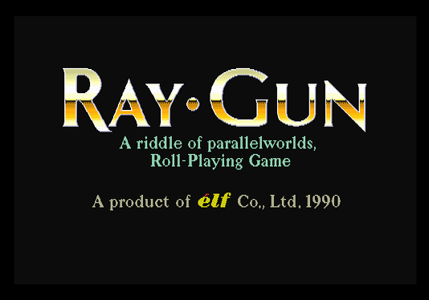
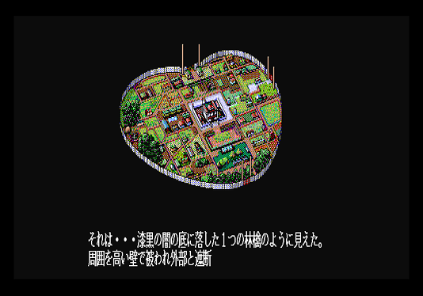
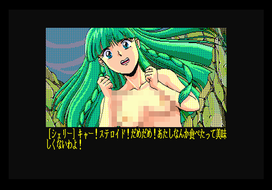

# Ray-Gun for the Sharp X68000 - English Translation

# General Notes

*"Georgie(1) is a young man who lives with his fiancee Miria(2) in the quiet town of Lakeside, repairing large combat robots which are strangely called "steroids"(3). One day he discovers several such steroids in the forest, and as he decides to inspect them, unknown flying steroids kidnap Miria. Now Georgie has to pilot a steroid himself and to rescue his beloved one.*

*Ray Gun is a traditional Japanese RPG, with top-down navigation, random turn-based battles viewed from first-person perspective, etc. The combat is usually between the player's steroids and enemy ones. Steroids can attack normally or execute special techniques. Many cut scenes feature nudity."*

Description from [Mobygames.com](https://www.mobygames.com/game/sharp-x68000/ray-gun)

  * *(1) Georgie? I'd suggest George.*
  * *(2) Miria? Milia seems more likely.*
  * *(3) Steroid? Really??? I think we may need to change that...*

Ray Gun is a fairly early/simplistic RPG (or *roll* playing game, as the Engrish on the title exclaims!) game for the NEC PC-88, MSX and Sharp X68000.

This is my attempt to translate the content of the game to English. Why? Well it's a pretty simple game, the text is (mainly) stored uncompressed and in standard S-JIS form and I thought it would be fun to try something that doesn't appear to be very well known!

## Nudity!

Ray-Gun, as with many late-80's through early 90's RPG games on the aforementioned computers contains an element of nudity. Now, the content is fairly tame by most standards but this game is *not for children*, nor should it be considered safe for work.

## Spoilers!

There are some minor spoilers in this document - mainly (pixelated) images of some of the people you meet and/or locations. However I have tried to keep the amount of images shown to a minimum (there's generally one per text/dialogue/asset file to indicate which area of the game the data relates to) and they are pixellated to hide any not-safe-for-work content.

## Booting & Secret Menu

The game starts from Disk A / Disk 1, which you should have in the first drive, you also need Disk B / Disk 2 in the second drive.

There is a hidden menu with some secret content; if you swap Disk 1 and Disk 2 (i.e. you have Disk 2 in the first drive and Disk 1 in the second drive on boot) you instead get a bonus content of a secret menu.

The bonus menu offers the following content:

- A slideshow of the various *not-safe-for-work* animations without having to unlock them
- A music test mode

## Text Format

Unless otherwise noted, all text is in Shift-JIS format and represented by two bytes within the game files.

## Translation Caveats

I am not a Japanese speaker, neither can I read Hiragana, Katakana nor Kanji. All of the translations I will make in this exercise will be primarily sourced from machine translation, dictionary lookup or the [walkthrough guide](https://www.giantbomb.com/ray-gun/3030-38838/guide/) for non-Japanese speakers, so bear that in mind.

It won't be a simple one-to-one replacement though; the text will be extracted, studied and re-inserted so that it makes sense - no *"set us up the bomb!"*, as long as I can help it!

---

# Steps for Translation

  1. Identify all of the data files which contain translatable text.
  2. Extract the Japanese strings from the above files and do an initial machine translation.
  3. Rewrite the machine translation to make sense, standardise and fix naming conventions and other story elements.
  4. Reinsert fixed text back in to data files.

For each data file found, there is an individual status summary listed against it in the *Disk Content Overview* section.

At present, we are working on (1) and (2), though where it is obvious, I am making small edits to (3) as I go (fixing glaring translation typos, for example).

---

# Disk Content Overview

## Disk A / Disk 1

Contents (in root folder, unless otherwise noted):

  * DISKNO - Contains the bytes 0x00 0x1A
  * COMMAND.X, HUMAN.SYS, AUTOEXEC.BAT - basic Human68k OS (this is a bootable floppy)
  * AI.X, CSS2.X, JISIN.X - The game executables.
  * .MES Files - The main source of dialogue and text.
  * .ATR Files - Unknown
  * .DAT Files - Unknown
  * GAMEN.PR7 - Image data
  * ANI/.ANI Files - Some sort of data format that animates between .PR7 image files.
  * PIC/.PR7 Files - Image data

### Disk 1 - START.MES

This data file contains the text which is shown at the beginning of the game, immediately after the start screen. This text scrolls up the screen, starting with an image of the town the main character lives in and changing through various images (see below for example).

The section continues through many scrolling/animated images, including those of your girlfriend being kidnapped by the bad guys of the game. The game proper then begins, with you dropped onto the overworld map. At this point START.MES is no longer used.

All the text in this file relates to that animated intro.

[START.MES](csv/disk1/START.MES.csv) - Japanese to English mapping CSV

Status:

  * Japanese text extraction: 100%
  * Literal English text: 100%
  * Rewritten English text: 5%
  * Reinsertion progress: 0%

### Disk 1 - FL1_1.MES

This data file contains the text conversations with the NPC "Moon", who you meet on the first level. 

Only one image/animation loading sequence is mentioned in the entire file. This, presumably, is the animation of "Moon" speaking to the player.

Every string in this file is seperated by a single delimiter type: `0xA6 0xAA`.

[FL1_1.MES](csv/disk1/FL1_1.MES.csv) - Japanese to English mapping CSV

Status:

  * Japanese text extraction: 100%
  * Literal English text: 100%
  * Rewritten English text: 0%
  * Reinsertion progress: 0%

### Disk 1 - FL1_2.MES

### Disk 1 - FL1_3.MES

### Disk 1 - FL1_4.MES

### Disk 1 - FL1_5.MES

This data file contains the text which is shown whilst talking to the NPC "Sherri", the first person you encounter on starting the game (see below for the state in which you encounter her).

This encounter is immediately after leaving the introduction animation and before you even get control over your in-game character.

Every string in this file is seperated by a single delimiter type: `0xA6 0xAA`.

[FL1_5.MES](csv/disk1/FL1_1.MES.csv) - Japanese to English mapping CSV

Status:

  * Japanese text extraction: 100%
  * Literal English text: 100%
  * Rewritten English text: 0%
  * Reinsertion progress: 0%

### Disk 1 - FL1_6.MES

### Disk 1 - FL1_7.MES

### Disk 1 - FL1_8.MES

### Disk 1 - INIT.MES

This data file contains text strings related to the level/floor select system.

  * Japanese text extraction: 0%
  * Literal English text: 0%
  * Rewritten English text: 0%
  * Reinsertion progress: 0%

---

## Disk B / Disk 2

  * DISKNO - Contains the bytes 0x01 0x1A
  * COMMAND.X, HUMAN.SYS, AUTOEXEC.BAT - basic Human68k OS (this is a bootable floppy)
  * MUSIC.X - FM Synth driver to playback the Ray Gun music tracks
  * RAY_GUN.PCM - ???
  * START.MES - Text for the secret menu and music test screens
  * ANI/.ANI Files - Image data 
  * PIC/.PR7 Files - Animation data

As noted earlier, if this disk is used to boot, the *Secret Menu* will be shown, rather than the normal game start screen.

Beyond the single *Secret Menu* text, there is no dialogue to extract or translate on Disk 2, it contains image/animation data only.

---

## Disk C / Disk 3

  * DISKNO - Contains the bytes 0x02 0x1A
  * START.MES - 
  * ANI/.ANI Files - Image data 
  * PIC/.PR7 Files - Animation data

This is not a bootable disk.

Beyond the single *Secret Menu* text (which is identical to that found on Disk 2), there is no dialogue to extract or translate on Disk 3, it contains image/animation data only.